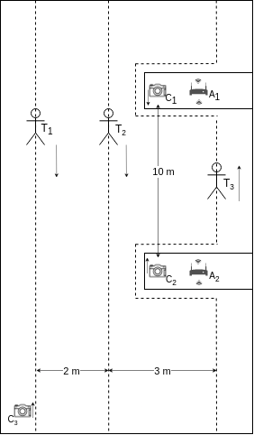

# Scenario 1

## Equipment

- 3 actors
- 3 tags 
- 3 cameras
- 2 anchors

## Details

- Distance between A1 and A2 is 10 m
- Distance between T1 and T2 is 2 m
- Distance between T2 and T3 is 3 m

## Description

     
    <em>Figure 1. Schema of the Scenario 1</em>

Figure 1 above shows a possible scenario of an experiment. There are 3 actors, each having a tag in the pocket. Cameras C1 and C2 and anchors A1 and A2 are placed on the cabinets. The distance between C1 and C2 (resp. A1 and A2) is equal to 10 m.

Camera C3 is placed in the corner next to the front door. Camera C1 is filming in the direction of front door. Cameras C2 and C3 are filming in the direction opposite to C1.

Distance between Actor 1 and Actor 2 is equal to 2 m that corresponds to the violated distance according to COVID19 restrictions. Actor 2 and Actor 3 have distance 3 m that does not violate restrictions.

All actors are moving along the dashed line shown on the Figure 1. Actor A1 and Actor A2 walk together and talk to each other. 

Actor 3 has a more difficult path, because he needs to overcome obstacles in the form of cabinets. He walks in the direction opposite to Actor 1 and Actor 2.

## Goal
The goal of the experiment is to detect violated social distance (2 m) between each pair of actors (tags). 

Actor 1 and Actor 2 walk together in the same direction. Actor 3 walks in opposite direction and has a distance of 3 meters from others. This may be used to calibrate software and hardware solutions.
